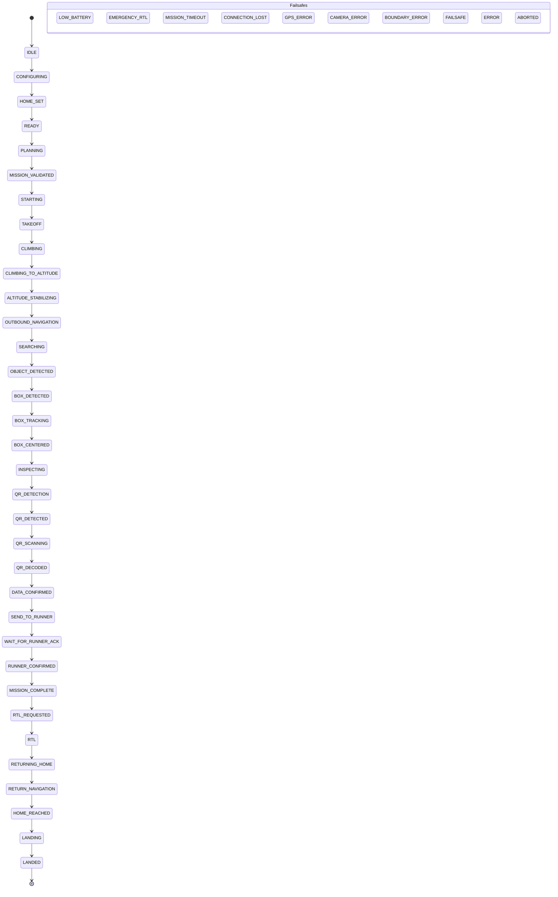

# SAE INDIA — Autonomous Drone Rescue & QR Mission System
# Complete Architecture, Protocol & Reproduction Specification for Claude / AI Agents

> **DOCUMENT PURPOSE:**  
> This specification contains the end-to-end architectural blueprints, protocol definitions, state machine matrices, hardware pinouts, deployment configs, and complete code templates for the **SAE INDIA Autonomous Drone Rescue & QR Mission System**. Feed this document directly into Claude (or any AI coding assistant) to reconstruct, replicate, or extend this mission-critical system with zero ambiguity.

---

## 1. Executive Summary & Mission Profile

The **SAE INDIA Drone Rescue & QR Mission** is an autonomous multirotor Unmanned Aerial Vehicle (UAV) avionics, computer vision, and Ground Control Station (GCS) suite designed for high-stress field competitions.

### Primary Mission Directives:
1. **Autonomous Takeoff & Ascent:** Autonomous arming, motor spin-up, and climb to an altitude of $10\text{m} - 15\text{m}$.
2. **Geofenced Area Traversal:** Search trajectory over a bounded polygon / search corridor (Expanding Spiral, Boustrophedon Grid, or Custom Waypoints).
3. **Visual Target Acquisition:** Real-time optical detection of a ground target box (kraft brown / white cuboid).
4. **Visual Servoing & QR Decoding:** Visual positioning over the target, multi-scale dynamic zoom ($1.0\times - 5.0\times$), and optical decoding of a **strictly two-digit numeric QR code** (Regex: `/^\d{2}$/`).
5. **Direct Runner Relay:** Instantaneous transmission of the decoded 2-digit code to the field runner device located $10\text{m} - 15\text{m}$ away over a dual-link communication channel (WebRTC P2P + Cloud Relay broadcast fallback).
6. **Radio Handshake Acknowledgment:** Zero-touch reception of cryptographic confirmation ACK (`QR_ACK`) from the field runner.
7. **Autonomous RTL & Recovery:** Immediate Return-To-Launch (`RTL`) to launch coordinates and precision landing within the **strict 3-minute (180-second) mission deadline**.

---

## 2. End-to-End System Topology

```text
+----------------------------------------------------------------------------------------------------+
|                                         AIRBORNE SEGMENT                                           |
|                                                                                                    |
|   +-----------------------+     TELEM2 UART (57600 baud)      +---------------------------------+  |
|   |   Pixhawk Autopilot   | <===============================> |       ESP32-S3 Telemetry        |  |
|   |  (ArduPilot Copter)   |    GPIO 18 (RX) / 17 (TX)         |       Wireless Bridge           |  |
|   +-----------------------+                                   +---------------------------------+  |
|               ^                                                                ||                  |
|               | USB-OTG Serial                                                 ||                  |
|               v                                                                ||                  |
|   +---------------------------------------+                                    ||                  |
|   | Airborne Android Phone (DRONE Role)   |                                    || Wi-Fi 802.11 bgn |
|   | - CameraVisionHUD (Canvas 1.0x-5.0x)  |                                    || (192.168.31.x)   |
|   | - jsQR & Box Contour Vision Engine    |                                    ||                  |
|   | - Direct USB-OTG MAVLink Transport    |                                    ||                  |
|   +---------------------------------------+                                    ||                  |
+-------------------|------------------------------------------------------------||------------------+
                    |                                                            ||
                    | Direct WebRTC DataChannel (P2P Radio Link)                 ||
                    v                                                            ||
+---------------------------------------+                                        ||
| Field Runner Device (RUNNER Role)     |                                        ||
| - Instant Auto-ACK Radio Receiver     |                                        ||
| - Sunlight-Readable Emergency Display |                                        ||
+---------------------------------------+                                        ||
                    ^                                                            ||
                    | Dual-Link Relay Broadcast                                  ||
                    v                                                            v
+----------------------------------------------------------------------------------------------------+
|                                    GROUND & CLOUD CLUSTER                                          |
|                                                                                                    |
|                                         +-------------------------------------------------------+  |
|                                         | Local Connector Agent (Laptop / Raspberry Pi)         |  |
|                                         | - Bridges LAN ESP32 (ws://192.168.31.194:8080/ws)     |  |
|                                         | - To Outbound Cloud WSS (wss://render-domain/connector)  |
|                                         +-------------------------------------------------------+  |
|                                                                    || Outbound TLS                 |
|                                                                    vv                              |
|   +---------------------------------------------------------------------------------------------+  |
|   | Cloud Secure WebSocket Relay (Render.com)                                                   |  |
|   | - Node.js ESM server listening on port 8443 / 10000                                         |  |
|   | - Token Auth: saeindia_sec_99348a7b1c0e                                                     |  |
|   | - Multiplexes MAVLink binary frames & JSON runner alerts between field and cloud            |  |
|   | - Endpoints: /ws (GCS Browsers), /connector (Drone Bridge), /health (HTTP 200)               |  |
|   +---------------------------------------------------------------------------------------------+  |
|                                                ^                                                   |
|                                                | Secure WebSocket (WSS)                            |
|                                                v                                                   |
|   +---------------------------------------------------------------------------------------------+  |
|   | Ground Control Station Web App (Netlify)                                                    |  |
|   | - React 18, TypeScript, Vite 5, Tailwind CSS                                                |  |
|   | - Leaflet GPS Waypoint & Search Corridor Geofence Planner (/googlemaps.html)                |  |
|   | - Real-time Artificial Horizon HUD, Battery Watchdog, Pre-arm Check Engine                  |  |
|   +---------------------------------------------------------------------------------------------+  |
+----------------------------------------------------------------------------------------------------+
```

---

## 3. Hardware Pinouts, Baud Rates & ArduPilot Config

### 3.1 Pixhawk TELEM2 to ESP32-S3 Wiring
| Pixhawk TELEM2 Pin | Signal | ESP32-S3 Pin | Operational Notes |
| :--- | :--- | :--- | :--- |
| **Pin 1** | `+5V VCC` | `5V / VIN` | Safe when Pixhawk is powered by LiPo battery (2.5A-3A max). |
| **Pin 2** | `TX (Out)` | `GPIO 18 (RX)` | Hardware UART Serial connection. |
| **Pin 3** | `RX (In)` | `GPIO 17 (TX)` | Hardware UART Serial connection. |
| **Pin 4** | `CTS` | `NC` | Flow control not required at 57600 baud. |
| **Pin 5** | `RTS` | `NC` | Flow control not required at 57600 baud. |
| **Pin 6** | `GND` | `GND` | Common electrical ground reference. |

### 3.2 ArduPilot Copter Parameters (Mission Planner / QGroundControl)
```ini
SERIAL2_PROTOCOL = 2      ; MAVLink 2 Framing
SERIAL2_BAUD     = 57     ; 57600 baud rate
BRD_SAFETYENABLE = 0      ; Disable physical safety switch for field autonomous missions
ARMING_CHECK     = 1      ; Enable strict pre-arm safety checks
FENCE_ENABLE     = 1      ; Enable geographic containment fence
FENCE_ACTION     = 1      ; RTL on fence breach
```

---

## 4. Communication Protocols & Message Schemas

### 4.1 MAVLink v2 Frame Specification
MAVLink v2 packets are transferred as binary frames over UART and WebSocket.
```
Byte 0:     Magic Byte: 0xFD (MAVLink v2 marker)
Byte 1:     Payload Length (0-255)
Byte 2:     Incompatibility Flags
Byte 3:     Compatibility Flags
Byte 4:     Packet Sequence Number (0-255)
Byte 5:     System ID (Default: 1)
Byte 6:     Component ID (Default: 1)
Byte 7-9:   Message ID (24-bit unsigned integer, Little-Endian)
Byte 10..N: Payload Bytes
Byte N+1..: Checksum (CRC-16-CCITT with message-specific seed)
```

**Key MAVLink Message IDs Handled:**
- `HEARTBEAT` (Msg ID `0`): Base mode, custom flight mode, system status.
- `GLOBAL_POSITION_INT` (Msg ID `33`): Latitude, longitude, relative altitude, velocity vectors.
- `ATTITUDE` (Msg ID `30`): Roll, pitch, yaw angles and angular rates.
- `SYS_STATUS` (Msg ID `1`): Battery voltage ($mV$), remaining capacity ($\%$), sensor health bitmasks.
- `GPS_RAW_INT` (Msg ID `24`): Fix type ($3 = 3\text{D Fix}$), visible satellites ($\ge 6$), HDOP ($\le 2.0$).
- `STATUSTEXT` (Msg ID `253`): Autopilot diagnostic alerts and pre-arm failure notices.
- `COMMAND_LONG` (Msg ID `76`): Arm (`MAV_CMD_COMPONENT_ARM_DISARM`), Takeoff (`MAV_CMD_NAV_TAKEOFF`), RTL (`MAV_CMD_NAV_RETURN_TO_LAUNCH`).

### 4.2 Secure Cloud Relay WebSocket Protocol (Render)
- **Browser Endpoint (`/ws`):** Accessible by ground stations and runner observers.
- **Drone / Connector Endpoint (`/connector`):** Authenticated via query parameter `?token=saeindia_sec_99348a7b1c0e` or header `x-relay-token`.
- **Health Check (`/health`):** HTTP GET returning JSON status.

#### Control Messages (JSON):
```json
// Relay Server -> Browser (Connection State)
{
  "type": "RELAY_STATUS",
  "connectorOnline": true,
  "esp32Online": true,
  "error": null
}

// Local Connector -> Relay Server (ESP32 State Report)
{
  "type": "ESP32_STATUS",
  "status": "CONNECTED",
  "error": ""
}

// P2P / Runner Radio Broadcast Message
{
  "type": "RUNNER_MSG",
  "code": "42",
  "timestamp": 1728283921000,
  "ack": false
}
```

---

## 5. Master 53-Step Flight Mission State Machine

Defined in `src/types/mission.ts` and managed by `src/services/missionEngine.ts`:



### Safety Interlocks & Watchdog Thresholds:
1. **Mission Timer:** Strictly 180 seconds. At $t = 0\text{s}$, trigger `EMERGENCY_RTL`.
2. **Battery Threshold:**
   - $\le 25\%$: Voice caution alert.
   - $\le 20\%$ or $< 10.8\text{V}$ (3S LiPo): Mandatory autonomous `EMERGENCY_RTL`.
3. **Heartbeat Loss:** If no heartbeat is received from the autopilot for $> 4500\text{ms}$, raise link-loss alarm and initiate failsafe.
4. **Airborne Disarm Guard:** Disarming while relative altitude $> 0.4\text{m}$ requires explicit two-step modal confirmation to prevent catastrophic mid-air motor cutoff.
5. **QR Code Integrity:** Must strictly match `/^\d{2}$/`. All non-numeric or single/triple-digit payloads are rejected.

---

## 6. Directory Structure & Key Files

```text
saeindia/
├── .agents/                                # Custom Antigravity agent plugins and rules
├── GEMINI.md                               # Operational directives & safety constraints
├── MEMORY.md                               # Persistent architectural memory
├── DEPLOYMENT.md                           # Render and Netlify deployment instructions
├── CLAUDE_REPRODUCTION_SPEC.md             # This comprehensive reproduction specification
├── netlify.toml                            # Netlify build, SPA routing, permissions config
├── render.yaml                             # Render root blueprint for relay server
├── package.json                            # Root frontend scripts and dependencies
├── vite.config.ts                          # Vite bundler configuration
├── tsconfig.json                           # Strict TypeScript configuration
├── build-apk.cjs                           # Cross-platform Node.js Android APK build script
├── test-e2e.cjs                            # Automated full-pipeline MAVLink telemetry test
│
├── public/
│   ├── _redirects                          # Netlify SPA fallback redirect rule
│   ├── googlemaps.html                     # Standalone high-res boundary management map
│   └── manifest.json                       # Progressive Web App (PWA) manifest
│
├── relay-server/                           # BACKEND: Secure Cloud WebSocket Relay
│   ├── server.js                           # Node.js ESM server (HTTP + WSS + Health + CORS)
│   ├── package.json                        # Dependencies: "ws": "^8.18.0"
│   ├── render.yaml                         # Render service configuration
│   └── .env.example                        # PORT=8443, RELAY_TOKEN=...
│
├── local-connector/                        # FIELD: Local Laptop / Pi Relay Agent
│   ├── connector.js                        # Bridges LAN ESP32 to Cloud Relay
│   ├── index.js                            # Module entrypoint alias
│   ├── package.json                        # Dependencies: "ws": "^8.18.0"
│   └── .env.example                        # ESP32_HOST, ESP32_PORT, RELAY_URL, RELAY_TOKEN
│
├── esp32-firmware/                         # FIRMWARE: ESP32-S3 Hardware Bridge
│   ├── esp32_cloud_relay_client.ino        # Direct WSS client firmware for ESP32-S3
│   └── README.md                           # Arduino IDE setup and flashing guidelines
│
└── src/                                    # FRONTEND: React 18 + TypeScript GCS
    ├── App.tsx                             # Master routing, role switching, views
    ├── main.tsx                            # React DOM initialization
    ├── vite-env.d.ts                       # Environment variable typing
    ├── components/
    │   ├── Drone/
    │   │   ├── PixhawkConnectionCard.tsx   # USB / LAN / Secure Relay multi-mode connector
    │   │   ├── FlightInstrumentHUD.tsx     # Artificial horizon, airspeed, altitude tape
    │   │   ├── CameraVisionHUD.tsx         # Computer vision target detector & dynamic zoom
    │   │   └── GoogleMapGroundStation.tsx  # Interactive waypoint & geofence drawer
    │   ├── Runner/
    │   │   └── RunnerScreen.tsx            # Outdoor sunlight-optimized QR code display
    │   └── Common/
    │       └── DisarmSafetyConfirmModal.tsx # High-severity mid-air motor cutoff guard
    ├── services/
    │   ├── mavlinkService.ts               # Binary MAVLink v2 parsing and packet generation
    │   ├── missionEngine.ts                # 53-step mission execution state machine
    │   ├── runnerCommService.ts            # Dual-link WebRTC P2P + Relay fallback service
    │   ├── visionService.ts                # Canvas zoom sweeps & jsQR optical decoder
    │   └── transports/
    │       ├── Esp32WebSocketTransport.ts  # Robust WebSocket transport with auto-reconnect
    │       └── WebUsbTransport.ts          # Native Android & browser USB-OTG serial driver
    └── types/
        ├── mavlink.ts                      # MAVLink frame, heartbeat, telemetry interfaces
        └── mission.ts                      # Mission phases, waypoint schemas, action types
```

---

## 7. Complete Code References for Deployment

### 7.1 Backend: `relay-server/server.js`
```javascript
import http from 'http';
import fs from 'fs';
import path from 'path';
import { fileURLToPath } from 'url';
import { WebSocketServer, WebSocket } from 'ws';

const __filename = fileURLToPath(import.meta.url);
const __dirname = path.dirname(__filename);

const PORT = process.env.PORT || 8443;
const RELAY_TOKEN = process.env.RELAY_TOKEN || 'saeindia_sec_99348a7b1c0e';

let connectorSocket = null;
let esp32Online = false;
let esp32LastError = '';
const browserSockets = new Set();

let rxBytesTotal = 0;
let txBytesTotal = 0;
let packetsForwarded = 0;

const server = http.createServer((req, res) => {
  const reqUrl = new URL(req.url, `http://${req.headers.host || 'localhost'}`);
  const pathname = reqUrl.pathname;
  
  if (pathname === '/health') {
    res.writeHead(200, {
      'Content-Type': 'application/json',
      'Access-Control-Allow-Origin': '*'
    });
    res.end(JSON.stringify({
      service: 'SAE INDIA MAVLink Secure WSS Relay',
      status: 'ok',
      uptime: process.uptime(),
      connectorOnline: connectorSocket !== null && connectorSocket.readyState === WebSocket.OPEN,
      esp32Online,
      esp32LastError,
      browserClientsCount: browserSockets.size,
      rxBytesTotal,
      txBytesTotal,
      packetsForwarded
    }, null, 2));
    return;
  }

  res.writeHead(200, { 'Content-Type': 'application/json', 'Access-Control-Allow-Origin': '*' });
  res.end(JSON.stringify({ service: 'SAE INDIA MAVLink Secure WSS Relay', status: 'ok' }));
});

const wss = new WebSocketServer({ noServer: true });

function broadcastStatusToBrowsers() {
  const statusMsg = JSON.stringify({
    type: 'RELAY_STATUS',
    connectorOnline: connectorSocket !== null && connectorSocket.readyState === WebSocket.OPEN,
    esp32Online: connectorSocket !== null && connectorSocket.readyState === WebSocket.OPEN && esp32Online,
    error: connectorSocket === null 
      ? 'ESP32 connector offline' 
      : (!esp32Online ? (esp32LastError || 'ESP32 unavailable') : null)
  });

  for (const client of browserSockets) {
    if (client.readyState === WebSocket.OPEN) {
      try { client.send(statusMsg); } catch (err) {}
    }
  }
}

server.on('upgrade', (request, socket, head) => {
  const reqUrl = new URL(request.url, `http://${request.headers.host || 'localhost'}`);
  const pathname = reqUrl.pathname;
  const token = reqUrl.searchParams.get('token') || request.headers['x-relay-token'];

  if (pathname === '/connector') {
    const allowedTokens = new Set([
      RELAY_TOKEN.trim(),
      'saeindia_sec_99348a7b1c0e',
      'saeindia_secret_token_2026'
    ]);

    if (!token || !allowedTokens.has(token.trim())) {
      socket.write('HTTP/1.1 401 Unauthorized\r\n\r\n');
      socket.destroy();
      return;
    }

    wss.handleUpgrade(request, socket, head, (ws) => {
      connectorSocket = ws;
      esp32Online = true;
      broadcastStatusToBrowsers();

      ws.on('message', (data, isBinary) => {
        if (isBinary) {
          rxBytesTotal += data.length;
          packetsForwarded++;
          for (const b of browserSockets) {
            if (b.readyState === WebSocket.OPEN) b.send(data, { binary: true });
          }
        } else {
          try {
            const msg = JSON.parse(data.toString());
            if (msg.type === 'ESP32_STATUS') {
              esp32Online = msg.status === 'CONNECTED';
              broadcastStatusToBrowsers();
            }
          } catch (e) {}
        }
      });

      ws.on('close', () => {
        connectorSocket = null;
        esp32Online = false;
        broadcastStatusToBrowsers();
      });
    });
    return;
  }

  if (pathname === '/ws' || pathname === '/') {
    wss.handleUpgrade(request, socket, head, (ws) => {
      browserSockets.add(ws);
      broadcastStatusToBrowsers();

      ws.on('message', (data, isBinary) => {
        if (isBinary && connectorSocket?.readyState === WebSocket.OPEN) {
          txBytesTotal += data.length;
          connectorSocket.send(data, { binary: true });
        } else if (!isBinary) {
          for (const b of browserSockets) {
            if (b !== ws && b.readyState === WebSocket.OPEN) b.send(data);
          }
        }
      });

      ws.on('close', () => browserSockets.delete(ws));
    });
    return;
  }

  socket.write('HTTP/1.1 404 Not Found\r\n\r\n');
  socket.destroy();
});

server.listen(PORT, () => {
  console.log(`Relay running on port ${PORT}`);
});
```

### 7.2 Frontend: `netlify.toml`
```toml
[build]
  command = "npm run build"
  publish = "dist"

[build.environment]
  NODE_VERSION = "20"
  NPM_FLAGS = "--legacy-peer-deps"

[[redirects]]
  from = "/googlemaps.html"
  to = "/googlemaps.html"
  status = 200

[[redirects]]
  from = "/*"
  to = "/index.html"
  status = 200

[[headers]]
  for = "/*"
  [headers.values]
    X-Frame-Options = "SAMEORIGIN"
    X-Content-Type-Options = "nosniff"
    Referrer-Policy = "strict-origin-when-cross-origin"
    Permissions-Policy = "camera=*, geolocation=*, microphone=*"

[[headers]]
  for = "/assets/*"
  [headers.values]
    Cache-Control = "public, max-age=31536000, immutable"
```

### 7.3 Backend: `render.yaml`
```yaml
services:
  - type: web
    name: saeindia-relay-server
    runtime: node
    plan: free
    rootDir: relay-server
    buildCommand: npm install
    startCommand: node server.js
    healthCheckPath: /health
    envVars:
      - key: PORT
        value: 10000
      - key: RELAY_TOKEN
        value: saeindia_sec_99348a7b1c0e
      - key: NODE_ENV
        value: production
```

---

## 8. Master Prompt for Claude to Replicate the System

You can copy and paste the prompt below directly into Claude:

```markdown
Please recreate the full SAE INDIA Autonomous Drone Rescue & QR Mission System according to the exact architectural specifications below:

1. System Components:
   - Frontend Ground Control Station (React 18 + TypeScript + Vite 5 + Tailwind CSS).
   - Backend Cloud Secure WebSocket Relay (Node.js ESM + 'ws' package).
   - Local Connector Agent (Node.js CLI bridging local ESP32 LAN to Cloud Relay).
   - ESP32-S3 C++ Arduino firmware bridging Pixhawk TELEM2 UART (57600 baud) to WebSocket.

2. Critical Constraints & Flight Protocols:
   - Must use MAVLink v2 binary framing (Magic Byte 0xFD).
   - Strict 180-second mission countdown timer triggering autonomous EMERGENCY_RTL upon expiration.
   - Target QR code is strictly a two-digit numeric string matching /^\d{2}$/.
   - Dual-link Runner communication: WebRTC DataChannel P2P with automatic fallback to Cloud Relay JSON broadcast, with immediate zero-touch confirmation ACK.
   - Pre-arm safety checklist: GPS sats >= 6, HDOP <= 2.0, Battery >= 10.8V / 20%, EKF healthy.
   - Double confirmation safety modal required if motor disarm is triggered while airborne (altitude > 0.4m).

3. Cloud Deployment:
   - Backend on Render using render.yaml with health check at /health and endpoints /ws and /connector.
   - Frontend on Netlify using netlify.toml, SPA client routing redirects (/* -> /index.html 200), and camera/geolocation Permissions-Policy.

Please generate the complete codebase, configuration files, and state machine according to the SAE INDIA specification.
```
